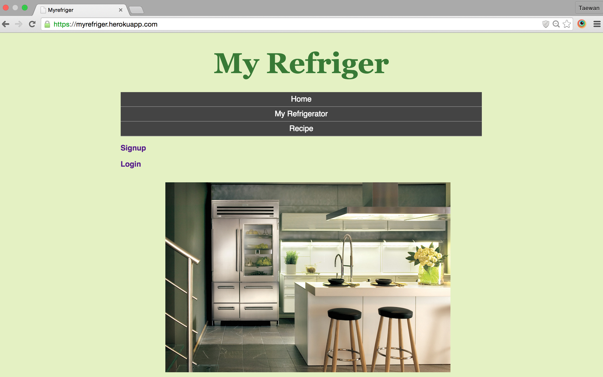
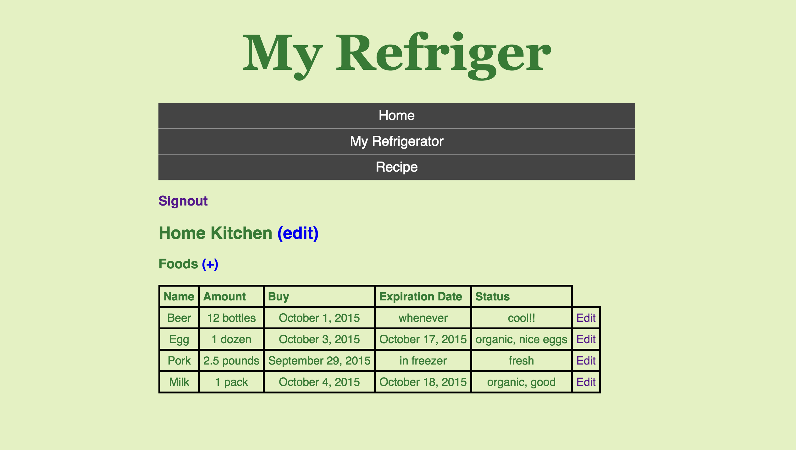
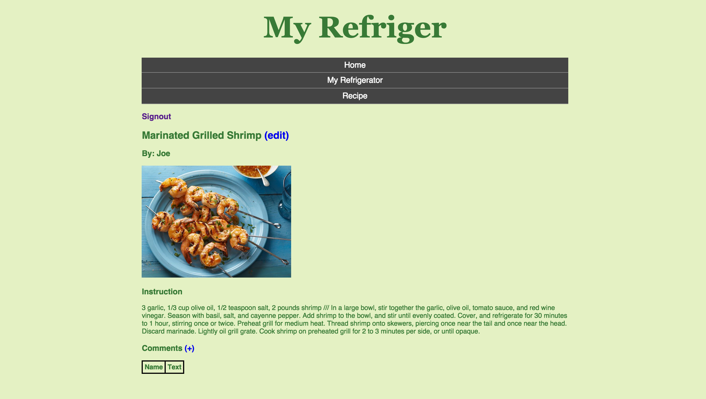

# MyRefriger
Welcome to MyRefriger, a Ruby on Rails application designed for tracking the date of foods and freshness inside refrigerator.

After we shop foods at a grocery store and put them in the refrigerator, we sometimes forget what we have in there later. Some foods stay in the refrigerator for a long time, and we buy same foods again without eating previous ones. So, this app allows users to write the first date putting the foods in the refrigerator and the expiration date of foods so we can track what we have and the freshness of foods.

## Screenshots

## Approach taken
After we shop foods at a grocery store and put them in the refrigerator, we sometimes forget what we have in there later. Some foods stay in the refrigerator for a long time, and we buy same foods again without eating previous ones. So, this app allows users to write the first date putting the foods in the refrigerator and the expiration date of foods so we can track what we have and the freshness of foods.

## User Stories
As a user,
- sign in to use features of the website as an user and sign out to end all sessions
- add products or foods an user puts in the refrigerator to the post table
- delete products or foods from the table if an user eats them or throws away
- add the first date in the refrigerator and expiration date of food on the table to track the date
- update the foods status to see the freshness of foods
- comment on recipe's posts

## Technologies used
- Developed using Ruby on Rails.
- All gems included in Gemfile : Devise, rails_12factor, pg, pry

## Unsolved problems
- adding more complex relational models and associations (ex. Food Categories).
- adding further functionality to alert users about their expired foods.
